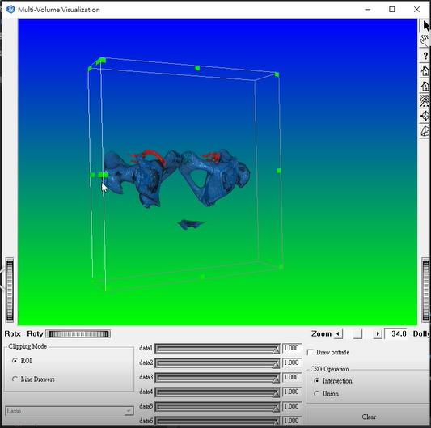
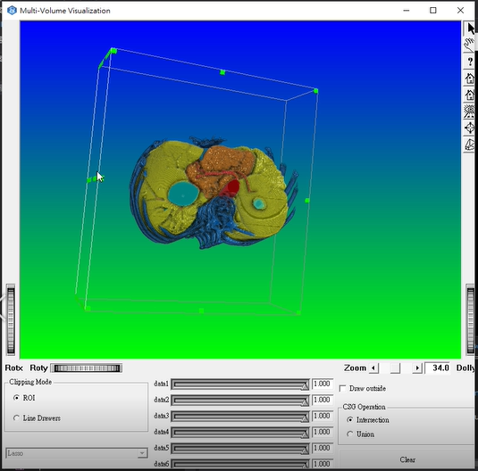
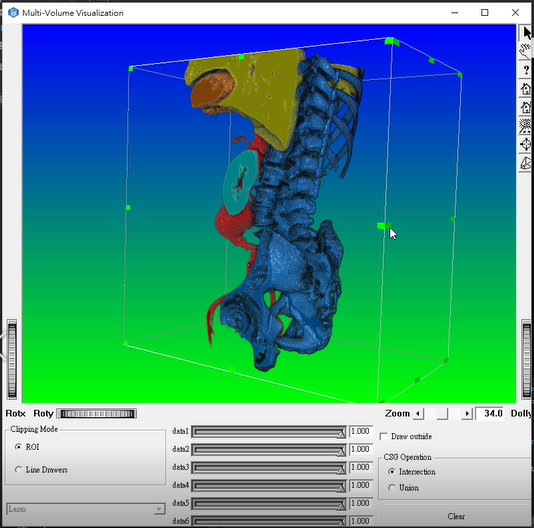

## Brief
- **Period:** July to December, 2018 (2nd half)
- **Status:** 3rd year CS student, NCTU
- **Locale:** [VIML@NCHC](http://viml.nchc.org.tw/home/)
- **Attendance:** once a week, 8 hours each
- **Tasks:** mainly 3D data visualization
- **Tools:** Open Inventor SDK 9.8, Visual Studio 2017
[Here](https://drive.google.com/open?id=1oIqtGDZVdxteLaew-9zQLW-10UpUObEf)is a brief presentation introducing the usage of the API and summarizing the work I have done.

## Motivation
- To explore the functionalities and performance of Open Inventor SDK.
- To employ it in 3D data visualization by building an interactive interface.
- To learn rendering basics in CG and familiarize with the API.
## Breakdown
### Phase 0: Familiarize with Open Inventor
### Phase 1: Single Volume Visualization

  
  

### Phase 2: Multiple Volume Visualization

  
  
  
  

### Phase 3: Visualization in VR
